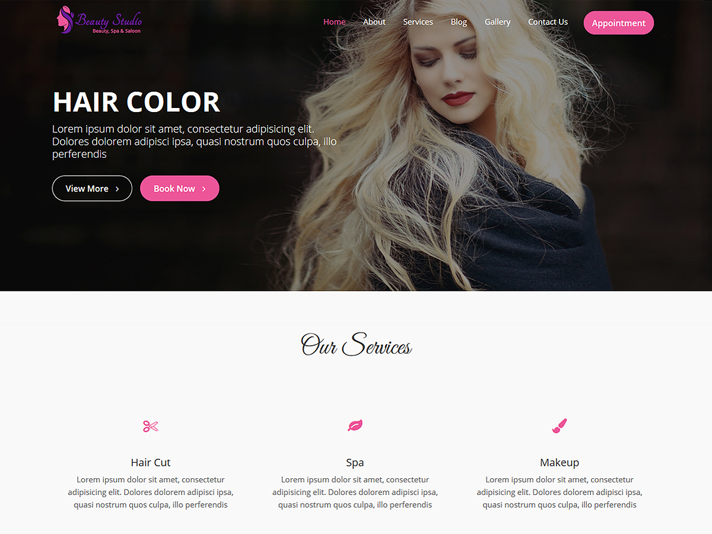

# Beauty Studio

**Contributors:** acmethemes  
**Requires at least:** 6.6  
**Tested up to:** 7.0  
**Requires PHP:** 7.4  
**Stable tag:** 4.0.0  
**License:** GPLv2 or later  
**License URI:** https://www.gnu.org/licenses/gpl-2.0.html  

> 

Beauty Studio is a WordPress theme purpose-built for beauty salons, spas, and cosmetic brands. Its elegant, trendy design captures the glamour of the beauty world while remaining highly functional. With deep WooCommerce integration, you can showcase services and sell products directly from your site.

## Features

- **Up to four-column layouts** — flexible grid for galleries and products
- **Featured section** — full-width slider to highlight services, promotions, or looks
- **WooCommerce ready** — sell cosmetics, skincare, and gift cards online
- **Post formats** — standard, gallery, image, and video for tutorials and portfolios
- **Site Origin Page Builder compatible** — drag-and-drop page building
- **Custom widgets** — purpose-built for beauty businesses
- **Social media integration** — connect Instagram, Pinterest, and more
- **Custom colors & background** — match your brand identity
- **Footer widgets** — display contact info, hours, and links
- **Translation ready** — .pot file included
- **RTL support** — right-to-left language compatible
- **Responsive design** — looks flawless on phones and tablets

## Installation

1. Download the theme zip file.
2. In your WordPress admin, go to **Appearance → Themes**.
3. Click **Add New** → **Upload Theme**.
4. Select the zip file and click **Install Now**.
5. Click **Activate**.

## Frequently Asked Questions

### How do I set up the front page as a static page?

1. Create a new page in **Pages → Add New**.
2. Go to **Settings → Reading**.
3. Under "Front page displays," choose **A static page** and select your page.
4. The "Home Main Content Area" widget zone will appear on the homepage.

### How do I change content or customize the site?

Go to **Appearance → Customize** to adjust layout, colors, featured content, and more.

## Credits

Beauty Studio is built on [Underscores](https://underscores.me/) and licensed under GPLv2 or later. It bundles the following third-party resources:

- [Google Fonts](https://fonts.google.com/) — Apache License 2.0
- [Font Awesome](https://fontawesome.com/) — MIT / SIL OFL 1.1
- [normalize.css](https://necolas.github.io/normalize.css/) — MIT
- [Theia Sticky Sidebar](https://github.com/WeCodePixels/theia-sticky-sidebar) — MIT
- [Breadcrumb Trail](https://github.com/justintadlock/breadcrumb-trail) — GPLv2+
- [TGM Plugin Activation](http://tgmpluginactivation.com/) — GPLv2+
- [html5shiv](https://github.com/afarkas/html5shiv) — MIT
- [Respond.js](https://github.com/scottjehl/Respond) — MIT

---

[Demo](http://demo.acmethemes.com/beauty-studio) &middot; [Support](https://www.acmethemes.com/supports/) &middot; [Acme Themes](https://www.acmethemes.com)
